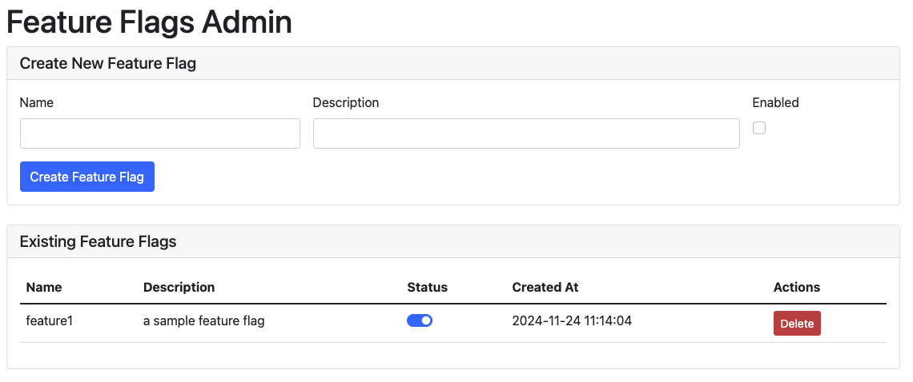

# RailsFlags

A simple and powerful feature flagging system for Ruby on Rails applications. RailsFlags provides an easy way to manage feature flags with support for multiple storage backends.

## Features

- Multiple storage adapters (Redis, Memory)
- Simple and intuitive API
- Thread-safe operations
- Configurable default states
- Support for flag metadata (descriptions, creation timestamps)
- Built-in admin interface for managing feature flags

## Installation

Add this line to your application's Gemfile:

```ruby
gem "rails_flags"
```

And then execute:
```bash
bundle install
```

## Configuration

RailsFlags can be configured with different adapters based on your needs:

### Memory Adapter (Default)
```ruby
# config/initializers/rails_flags.rb
RailsFlags.configure do |config|
    config.adapter = RailsFlags::Adapters::MemoryAdapter.new
end
```

### Redis Adapter
```ruby
# config/initializers/rails_flags.rb
RailsFlags.configure do |config|
    config.adapter = RailsFlags::Adapters::RedisAdapter.new(
        host: "localhost",
        port: 6379
    )
end
```

## Usage

### Mounting the Engine
Add this to your `config/routes.rb`:
```ruby
Rails.application.routes.draw do
  mount RailsFlags::Engine => "/rails_flags"
end
```

### Admin Interface
Access the admin interface at `/rails_flags/admin` to:
- View all feature flags
- Create new feature flags
- Enable/disable flags
- Delete feature flags



### Programmatic Usage

#### Registering Flags
```ruby
# Register a new feature flag (disabled by default)
RailsFlags.register(
  :new_feature,
  enabled: false,
  description: "Awesome new feature"
)

# Register an enabled feature flag
RailsFlags.register(
  :another_feature,
  enabled: true,
  description: "Another awesome feature"
)
```

#### Checking Flags
```ruby
# Check if a flag is enabled
if RailsFlags.enabled?(:new_feature)
  # Feature code here
end

# Check if a flag is registered
RailsFlags.registered?(:new_feature)
```

#### Managing Flags
```ruby
# Enable a flag
RailsFlags.enable(:new_feature)

# Disable a flag
RailsFlags.disable(:new_feature)

# Delete a flag
RailsFlags.delete(:new_feature)

# Get all flags
all_flags = RailsFlags.all_flags
```

### In Views
You can use feature flags in your views:
```erb
<% if RailsFlags.enabled?(:new_feature) %>
  <!-- New feature content -->
<% end %>
```

## Storage Adapters

### Memory Adapter
- Simple in-memory storage
- Suitable for development and testing
- Data is lost when the application restarts

### Redis Adapter
- Persistent storage using Redis
- Suitable for production use
- Provides atomic operations
- Requires Redis server

## Testing

This gem supports multiple Rails versions (6.x, 7.x, and 8.x). We use Appraisal to test against different Rails versions.

To run the tests for all supported Rails versions:

```bash
bundle exec appraisal rspec
```

To run tests for a specific Rails version:

```bash
bundle exec appraisal rails-6 rspec  # For Rails 6
bundle exec appraisal rails-7 rspec  # For Rails 7
bundle exec appraisal rails-8 rspec  # For Rails 8
```

## Contributing

1. Fork it
2. Create your feature branch (`git checkout -b feature/my-new-feature`)
3. Commit your changes (`git commit -am 'Add some feature'`)
4. Push to the branch (`git push origin feature/my-new-feature`)
5. Create new Pull Request

## License

The gem is available as open source under the terms of the [MIT License](https://opensource.org/licenses/MIT).
